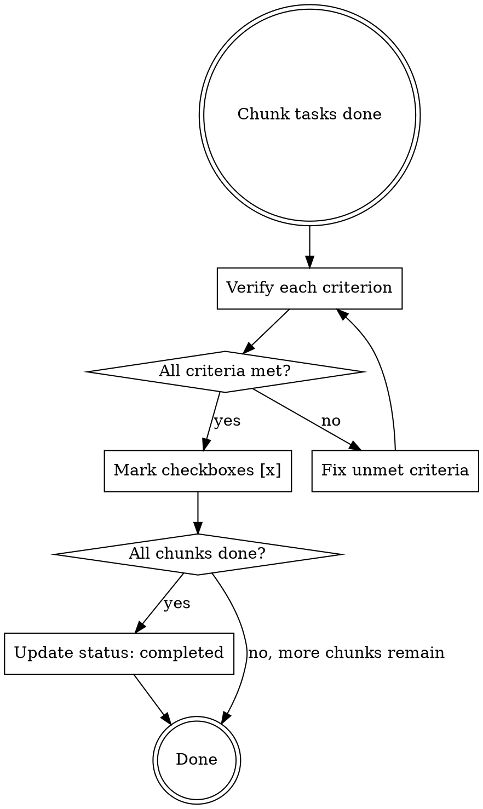

# Chunk Completion Marking

## Overview

exec-plan의 chunk 작업 완료 후 체크박스(`- [ ]` → `- [x]`)를 마킹하고 status를 갱신하는 스킬. 이 단계를 빠뜨리면 다음 세션이 동일 작업을 반복 실행한다.

## When to Use

- chunk의 모든 Task를 완료했을 때
- Session Prompt로 chunk 작업을 시작할 때 (완료 후 반드시 이 스킬 호출)
- exec-plan 파일의 Completion Criteria가 미체크인 chunk를 마무리할 때

## The Process



### Step 1: Verify Completion Criteria

각 `- [ ]` 항목을 실제로 검증한다. 파일이 존재하는지, 코드가 컴파일되는지, 기능이 동작하는지 직접 확인.

### Step 2: Mark Checkboxes

검증 통과한 항목을 `- [x]`로 변경. **부분 완료도 허용** — 통과한 것만 체크하고, 미통과 항목은 `- [ ]`로 남긴다.

### Step 3: Status 갱신

- 현재 chunk의 모든 criteria가 `[x]`이면 → 해당 chunk 완료
- exec-plan의 모든 chunk가 완료되면 → metadata의 `status: completed`로 변경. **파일 이동(`active/` → `completed/`)은 하지 않는다** — harness가 status 변경을 감지하여 자동 처리한다.

## Critical Rule: 파일 이동 금지

**exec-plan 파일을 `active/`에서 `completed/`로 이동하지 마라.** 이 스킬의 역할은 체크박스 마킹과 status 갱신까지다. 파일 이동은 harness가 담당한다. 스킬이 파일을 먼저 옮기면 harness가 경로를 찾지 못해 크래시가 발생한다.

## Exec-Plan File Format

```markdown
## Metadata
- status: in-progress  ← completed로 변경

## Chunk N: 제목

### Completion Criteria
- [ ] 미완료 항목     ← 검증 후 [x]로 변경
- [x] 완료된 항목

### Tasks
- Task 1: ...
- Task 2: ...
```

## Red Flags — Chunk 완료 시 반드시 확인

- chunk 작업을 끝냈는데 체크박스를 안 고쳤다 → **즉시 이 스킬 실행**
- "다음 세션에서 하면 되지" → **안 된다. 지금 마킹해야 한다**
- "코드는 돌아가니까 됐지" → **체크박스 마킹 없이는 미완료로 간주된다**
- Completion Criteria를 읽지 않고 Task만 완료했다 → **criteria를 하나씩 검증해라**
- "파일을 completed/로 옮겨야지" → **절대 안 된다. harness가 처리한다**

## Common Mistakes

| 실수 | 해결 |
|------|------|
| Task만 완료하고 Criteria 미체크 | Criteria를 기준으로 검증 후 체크 |
| 전체 plan status를 갱신 안 함 | 모든 chunk 완료 시 status: completed로 변경 (파일 이동은 harness가 처리) |
| 부분 완료인데 전체 완료 처리 | 통과한 항목만 [x], 나머지는 [ ]로 유지 |
| 검증 없이 일괄 체크 | 각 항목을 실제로 확인한 후에만 체크 |
| exec-plan 파일을 직접 이동 | 파일 이동은 harness 전용. 스킬은 status만 변경 |
