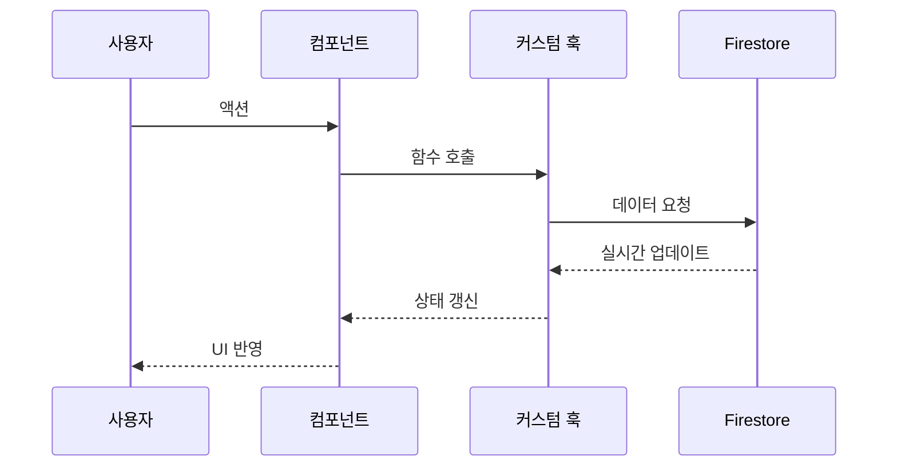
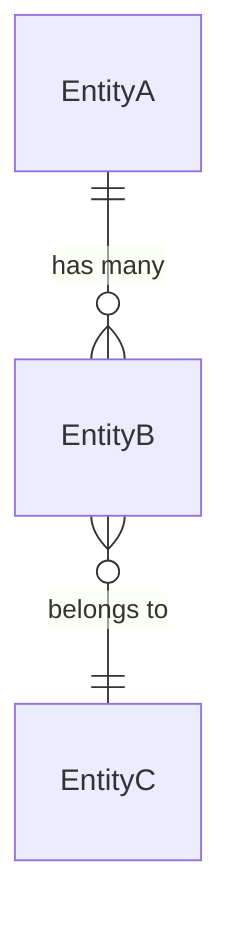
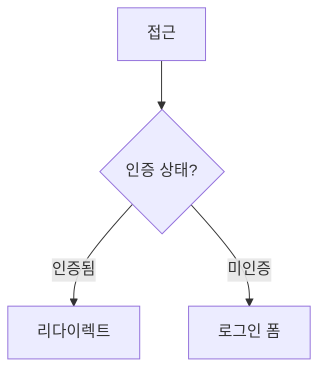

# 문서 출력 포맷

Phase 3에서 docs/ 구조를 생성할 때 각 문서가 따라야 하는 정확한 형식을 정의한다.

---

## 1. AGENTS.md

프로젝트의 진입점. Cowork 세션이 가장 먼저 읽는 파일이다. 200줄 이하 권장.

```markdown
# {프로젝트 이름}

{1~2문장 프로젝트 요약}

## Directory Map

- `src/` — {소스 코드 설명}
- `docs/specs/` — 설계 문서
- `docs/design-docs/` — 상세 설계 (데이터 모델, 인증, 운영 원칙 등)
- `docs/product-specs/` — 페이지/기능별 제품 스펙
- `docs/exec-plans/active/` — 현재 진행 중인 실행 계획
- `tests/` — 테스트
- {기타 주요 경로}

## Tech Stack

- **Language**: {언어}
- **Framework**: {프레임워크}
- **Database**: {DB}
- **Styling**: {스타일링 도구}
- **Package Manager**: {패키지 매니저}

## When Making Changes

1. {프로젝트별 변경 규칙}
2. 변경 후 반드시 `{테스트 명령}` 실행
3. 기존 패턴을 따를 것

## Chunk 완료 워크플로

exec-plan의 Chunk 작업을 완료한 후 반드시 다음 순서를 따른다:

1. `/engineering:code-review` 스킬을 사용하여 작성한 코드를 리뷰한다
2. 리뷰에서 발견된 문제를 수정한다
3. `/chunk-complete:chunk-complete` 스킬을 사용하여 Completion Criteria 체크박스를 마킹한다

**이 순서를 건너뛰지 않는다.** code-review 없이 chunk-complete를 실행하지 않는다.

## Conventions

- {언어/프레임워크 컨벤션}
- {코딩 스타일 규칙}
- {파일 명명 규칙}

## Key Design Decisions

{아키텍처적으로 중요한 결정과 그 이유. 새 세션이 잘못된 방향으로 가는 걸 방지}

## Writing Standards

- 한글/영어 혼용 가능 (프로젝트 언어에 맞춤)
- 경로는 프로젝트 루트 기준 상대 경로
- 코드 예시는 TypeScript 인터페이스 형태
```

---

## 2. ARCHITECTURE.md

프로젝트의 기술 아키텍처를 기술한다.

```markdown
# {프로젝트 이름} — 아키텍처

> {1줄 아키텍처 요약}
> 작성일: {YYYY-MM-DD}

---

## 1. 개요

{프로젝트가 어떤 문제를 어떻게 해결하는지 2~3문장}

## 2. 기술 스택

| 영역 | 기술 | 선택 이유 | 검토한 대안 |
|------|------|----------|-----------|
| {영역} | {기술} | {이유} | {대안과 배제 이유} |

## 3. 디렉토리 구조

{실제 파일 경로를 트리 형태로}

```
src/
  app/           — Next.js App Router
  components/    — 재사용 UI 컴포넌트
  lib/           — 비즈니스 로직
    firestore/   — Firestore CRUD 함수
  hooks/         — 커스텀 React 훅
  types/         — TypeScript 타입 정의
```

## 4. 핵심 데이터 흐름

{Mermaid sequence diagram으로 핵심 시나리오 1~2개}



## 5. 설계 원칙

{프로젝트의 핵심 설계 원칙 3~5개. core-beliefs.md의 요약 버전}
```

---

## 3. product-spec

페이지/기능별 상세 스펙. 프로젝트 타입에 따라 섹션이 달라진다.

### 3.1 공통 섹션 (모든 프로젝트 타입)

```markdown
# {페이지/기능 이름} — 제품 스펙

> {1줄 요약}
> 작성일: {YYYY-MM-DD}

---

## 1. Problem & Appetite

**해결하는 문제**: {구체적 문제 서술}

**투자 예산**: {예상 소요 시간/범위}

## 2. 유저 플로우

### 해피 패스

| # | 유저 액션 | 시스템 반응 | 화면 변화 |
|---|---------|-----------|----------|
| 1 | {액션} | {반응} | {변화} |
| 2 | ... | ... | ... |

### 에러 패스

| # | 에러 상황 | 유저가 보는 것 | 복구 방법 |
|---|---------|--------------|---------|
| 1 | {상황} | {메시지/UI} | {복구} |

## 3. 핵심 요소

### {요소 이름}

- **동작**: {이 요소가 하는 일}
- **상태**: {가질 수 있는 상태들}
- **예외**: {예외 케이스}
- **데이터 의존성**: {필요한 데이터와 출처}

## 4. 데이터 & API

```typescript
// Request
interface {기능}Request {
  field: Type;
}

// Response
interface {기능}Response {
  field: Type;
}
```

**에러 코드:**

| 코드 | 의미 | HTTP Status |
|------|------|------------|
| {코드} | {의미} | {status} |

## 5. 에러 처리

| 에러 조건 | 사용자 메시지 | 복구 동작 |
|----------|-------------|---------|
| {조건} | {메시지} | {동작} |

## 6. 성능 요구사항

| 지표 | 목표 | 측정 방법 |
|------|------|----------|
| {지표} | {수치} | {방법} |

## 7. 의존성

**이 기능이 의존하는 것:**
- {모듈/기능}: {이유}

**이 기능에 의존하는 것:**
- {모듈/기능}: {이유}

## 8. Rabbit Holes & Non-Goals

**빠지기 쉬운 함정:**
- {함정}: {왜 피해야 하는지}

**명시적으로 하지 않을 것:**
- {non-goal}: {이유}
```

### 3.2 web-app / mobile 추가 섹션

공통 8개 섹션 뒤에 추가한다.

```markdown
## 9. UI 구성

### 와이어프레임

```
┌─────────────────────────────────┐
│ Header                          │
├─────────────────────────────────┤
│ [+ 추가]  [필터 ▼]  [검색...]   │
├─────────────────────────────────┤
│ ☐ 할 일 1            ★ 높음    │
│ ☑ 할 일 2            ★ 보통    │
│ ☐ 할 일 3            ★ 낮음    │
└─────────────────────────────────┘
```

### 컴포넌트 계층

```
Page
├── Header
├── TodoToolbar
│   ├── AddButton
│   ├── FilterDropdown
│   └── SearchInput
└── TodoList
    └── TodoItem
        ├── Checkbox
        ├── Title
        └── PriorityBadge
```

### 상태별 화면

- **로딩**: {로딩 상태 설명}
- **빈 상태**: {데이터 없을 때}
- **에러 상태**: {에러 발생 시}

## 10. 상태 관리

**State Shape:**
```typescript
interface {페이지}State {
  items: Item[];
  loading: boolean;
  error: Error | null;
  filter: FilterType;
}
```

**사용할 훅:**
- `use{기능}`: {역할}

**로컬 state vs 서버 state:**
- 로컬: {항목들}
- 서버 (Firestore): {항목들}

## 11. 접근성

- **키보드 네비게이션**: {Tab/Enter/Escape 동작}
- **ARIA 속성**: {필요한 aria-* 속성}
- **포커스 관리**: {포커스 이동 규칙}
```

### 3.3 api / library 추가 섹션

공통 8개 섹션 뒤에 추가한다 (9~11 대신).

```markdown
## 9. 엔드포인트 상세

| 메서드 | 경로 | 인증 | Rate Limit | 설명 |
|--------|------|------|-----------|------|
| {메서드} | {경로} | {인증} | {제한} | {설명} |

### {엔드포인트} 상세

**Request:**
```typescript
// Headers
Authorization: Bearer {token}
Content-Type: application/json

// Body
interface RequestBody {
  field: Type;
}
```

**Response:**
```typescript
interface ResponseBody {
  field: Type;
}
```

## 10. SDK / 공개 인터페이스

```typescript
// Public API
export function functionName(params: Params): Promise<Result>;
```

**버전 호환성:**
- {semver 정책}
- {deprecated 정책}
```

---

## 4. design-docs/

### 4.1 core-beliefs.md

```markdown
# 에이전트 운영 원칙 및 기술 철학

> {1줄 요약}
> 작성일: {YYYY-MM-DD}

---

## 1. 목표

### {원칙 이름}

{원칙 설명. 왜 이 원칙이 중요한지, 어떤 결과를 기대하는지}

## 2. 설계

### {원칙 이름}

- **DO**: {이 원칙을 따르는 구체적 행동}
- **DON'T**: {이 원칙을 위반하는 구체적 행동}
```

### 4.2 data-model.md

```markdown
# 데이터 모델

> {1줄 요약}
> 작성일: {YYYY-MM-DD}

---

## 엔티티 정의

### {엔티티 이름}

| 필드 | 타입 | 제약조건 | 설명 |
|------|------|---------|------|
| {필드} | {타입} | {제약} | {설명} |

## 관계도



## Firestore 컬렉션 구조 (Firebase 프로젝트의 경우)

```
users/{userId}/
  todos/{todoId}          → Todo 문서
  categories/{categoryId} → Category 문서
tags/{tagId}              → Tag 문서 (전역)
```
```

### 4.3 auth.md

```markdown
# 인증 설계

> {1줄 요약}
> 작성일: {YYYY-MM-DD}

---

## 1. 목표

{인증 방식, 제약 조건, 세션 관리 방식}

## 2. 설계

### 인증 흐름



### 컴포넌트 구조

- **AuthProvider**: {역할}
- **useAuth 훅**: {반환값}
- **ProtectedRoute**: {동작}

## 3. 구현 세부사항

{라이브러리, 환경변수, Security Rules, 에러 처리}
```

### 4.4 deployment.md

```markdown
# 배포 전략

> {1줄 요약}
> 작성일: {YYYY-MM-DD}

---

## 환경 구성

| 환경 | URL | 용도 |
|------|-----|------|
| {환경} | {URL} | {용도} |

## CI/CD 파이프라인

{배포 흐름 설명}

## 환경변수

| 변수 | 설명 | 필수 |
|------|------|------|
| {변수} | {설명} | {Y/N} |
```

### 4.5 index.md (design-docs/, product-specs/ 공통)

```markdown
# {카테고리} 색인

| 문서 | 설명 | 상태 |
|------|------|------|
| [{파일명}](./{파일명}) | {1줄 설명} | Draft/Review/Approved |
```

---

## 5. 기타 파일

### 5.1 DESIGN_GUIDE.md

```markdown
# 디자인 가이드

> {1줄 요약}
> 작성일: {YYYY-MM-DD}

---

## 색상 팔레트

| 용도 | 색상 | HEX |
|------|------|-----|

## 타이포그래피

| 용도 | 폰트 | 크기 | 무게 |
|------|------|------|------|

## 간격 시스템

{간격 단위, 기본값}

## 컴포넌트 스타일

{버튼, 입력, 카드 등 기본 컴포넌트 스타일 가이드}

## 반응형

| 브레이크포인트 | 너비 | 레이아웃 변화 |
|-------------|------|-------------|
```

### 5.2 SECURITY.md

```markdown
# 보안 설계

> {1줄 요약}
> 작성일: {YYYY-MM-DD}

---

## 인증 & 인가

{인증 방식 요약, auth.md 참조}

## 데이터 보호

{데이터 암호화, 접근 제어 규칙}

## 알려진 위험

| 위험 | 심각도 | 대응 |
|------|--------|------|
```

### 5.3 QUALITY_SCORE.md

Phase 4에서 이 파일의 내용을 채운다. Phase 3에서는 빈 템플릿만 생성한다.

```markdown
# 품질 점수

> 생성일: {YYYY-MM-DD}
> 최종 평가: Phase 4 완료 후 채워짐

---

## 종합 점수

{Phase 4에서 채움}

## 상세 점수

{Phase 4에서 채움}
```

---

## 6. exec-plan 형식

exec-plan은 자동 실행 도구가 직접 파싱하므로 형식이 정확해야 한다.

### 6.1 전체 구조

```markdown
# {구현 계획 제목}

## Metadata
- project_dir: {프로젝트 루트 절대 경로}
- spec: {참조하는 설계 문서 상대 경로}
- created: {YYYY-MM-DD}
- status: pending

---

## Chunk 1: {Chunk 이름}

### Completion Criteria
- [ ] {기계적으로 검증 가능한 완료 조건}

### Tasks
- Task 1: {태스크 이름과 설명}

### Session Prompt
```
{Cowork 세션에 보내는 실제 프롬프트}
```

---

## Chunk 2: {Chunk 이름}
{같은 구조 반복}
```

### 6.2 파서 규격 (형식 필수)

| 요소 | 정규식 / 규칙 | 예시 |
|------|-------------|------|
| Chunk 헤더 | `^## Chunk (\d+): (.+)$` | `## Chunk 1: Foundation` |
| Completion Criteria | `^- \[([ x])\] (.+)$` (줄 시작, 공백 들여쓰기 없음) | `- [ ] pytest tests/ 통과` |
| Session Prompt | 첫 번째 코드 블록 사용. 없으면 `### Session Prompt` ~ `---` 또는 `##` 까지 | |
| Chunk 구분 | `---` | |
| 하위 섹션 순서 | Completion Criteria → Tasks → Session Prompt (순서 의존) | |

### 6.3 Completion Criteria 규칙

**허용 (기계적 검증 가능):**
- `pytest tests/test_auth.py 통과` (exit code 0)
- `src/lib/firebase.ts 파일 존재` (파일 시스템 확인)
- `npm run build 성공` (exit code 0)
- `localhost:3000 응답 status 200` (curl 확인)
- `응답 시간 < 200ms` (구체적 수치)

**금지 (주관적 판단):**
- ~~코드가 깔끔한지 확인~~
- ~~UI가 보기 좋은지 확인~~
- ~~성능이 충분한지 확인~~ (구체적 수치가 있으면 OK)

### 6.4 Chunk 크기 가이드라인

| 기준 | 권장 값 |
|------|--------|
| Task 개수 | 2~5개 |
| 예상 소요 시간 | 10~30분 |
| 파일 변경 수 | 3~10개 |
| Completion Criteria | 2~5개 |

### 6.5 Session Prompt 가이드

**포함해야 하는 것:**
- exec-plan 파일 경로
- 참조할 문서 경로 (AGENTS.md, spec 등)
- 완료 조건을 만족시키라는 지시
- Chunk 완료 워크플로 지시: "모든 Task 완료 후, `/engineering:code-review`로 코드 리뷰를 실행하고, 리뷰 통과 후 `/chunk-complete:chunk-complete`로 Completion Criteria 체크박스를 마킹해."

**넣으면 안 되는 것:**
- 코드 자체 (길어지면 컨텍스트 낭비)
- exec-plan에 이미 있는 정보의 중복 기술

### 6.6 파일명 규칙

`docs/exec-plans/planning/` 아래에 번호순으로 배치:
- `01-{이름}.md` — 예: `01-project-setup.md`
- `02-{이름}.md` — 예: `02-core-features.md`
- `03-{이름}.md` — 예: `03-ui-polish.md`

번호 순서가 실행 순서다. 의존성이 있는 plan이 먼저 오도록 배치한다.
