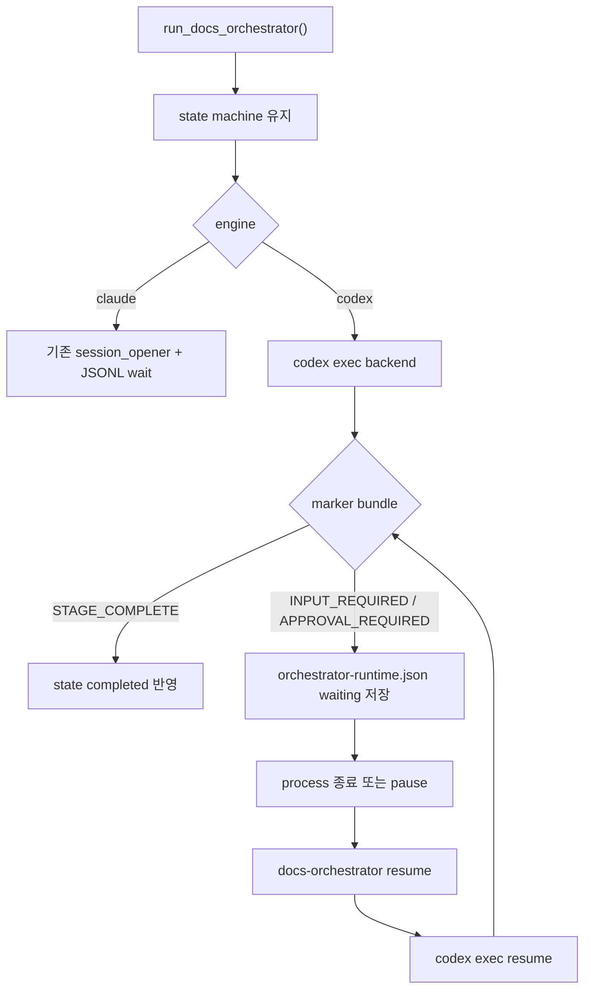

# Docs-Orchestrator Codex Exec Mode — 설계 문서

> `docs-orchestrator`에 Claude Desktop 경로를 보존한 채 `codex exec` 기반 백엔드를 추가한다.
> 작성일: 2026-04-10
> 상태: Approved

---

## 1. 목표

현재 `docs-orchestrator`는 세션 생성과 완료 감지가 Claude Desktop/Cowork JSONL 흐름에 직접 결합되어 있다.
이 때문에 문서 생성 오케스트레이션이 실행되는 동안 사용자의 로컬 macOS GUI가 사실상 점유된다.

이 문서의 목표는 다음과 같다.

1. 기존 Claude Desktop 기반 `docs-orchestrator` 경로를 깨지 않고 그대로 유지한다.
2. 동일한 phase/state machine 위에 `codex exec` 기반 비대화형 백엔드를 추가한다.
3. Codex backend는 질문/승인이 필요할 때 종료하지 않고 `resume_handle`을 저장한 뒤,
   이후 `codex exec resume`으로 같은 세션을 이어간다.
4. 이 설계 문서만 보고 구현자가 바로 코드를 수정할 수 있을 정도로 파일별 변경 지점,
   데이터 계약, 상태 전이, 테스트 범위를 구체적으로 고정한다.

---

## 2. 범위와 비범위

### 2.1 구현 범위

- `--mode docs-orchestrator`에 `engine=codex` 실행 경로 추가
- Codex용 runtime sidecar 상태 파일 추가
- Codex prompt wrapper 추가
- `docs-orchestrator resume` CLI 추가
- restart/recovery/stale runtime 처리
- Claude 경로 회귀 테스트 유지
- Codex 경로 신규 테스트 추가

### 2.2 구현 비범위

- 기존 Claude Desktop 경로의 동작 변경
- planning runtime 전체를 docs-orchestrator 공용 모듈로 대규모 통합
- interactive `codex resume --include-non-interactive` TUI handoff
- Claude/Codex 간 중간 phase 교차 전환
- docs-orchestrator state schema의 전면 개편

V1은 오직 다음 흐름만 지원한다.

- `codex exec`
- waiting
- `codex exec resume`

---

## 3. 현재 코드베이스에서 확인된 사실

아래 내용은 코드 확인 기준이다.

### 3.1 docs-orchestrator의 Claude 결합 지점

- `src/cowork_pilot/docs_orchestrator.py`
  - `_open_orchestrator_session()`
  - `_wait_for_session_completion()`
  - `_wait_with_cooperative_loop()`
  - `_wait_with_polling()`
- `src/cowork_pilot/session_opener.py`
  - Claude Desktop activate + 새 세션 열기

즉 phase state machine 자체보다 "세션 실행부"가 Claude에 묶여 있다.

### 3.2 Codex runtime primitive는 이미 존재

- `src/cowork_pilot/planning/codex_bridge.py`
  - `run_exec_stage()`
  - `run_exec_resume()`
- `src/cowork_pilot/codex/command_builder.py`
  - `build_exec_command()`
  - `build_exec_resume_command()`
- `src/cowork_pilot/codex/event_stream.py`
  - `extract_thread_id()`
- `src/cowork_pilot/planning/stage_executor.py`
  - `resume_stage_subsession()`
- `src/cowork_pilot/planning/runtime_orchestrator.py`
  - marker bundle 처리
- `src/cowork_pilot/planning/marker_protocol.py`
  - `INPUT_REQUIRED`, `APPROVAL_REQUIRED`, `STAGE_COMPLETE` 계약

### 3.3 docs-orchestrator config는 이미 engine inheritance를 가짐

- `src/cowork_pilot/config.py`
  - `DocsOrchestratorConfig.engine`
  - `load_docs_orchestrator_config()`

다만 현재 docs-orchestrator 실행부는 이 engine 값을 실제 backend 선택에 사용하지 않는다.

### 3.4 `_determine_next_step()`는 waiting 개념을 모름

`src/cowork_pilot/docs_orchestrator.py`의 `_determine_next_step()`는 `completed` 집합만 보고 다음 step을 결정한다.
즉 Codex waiting 상태를 별도 처리하지 않으면 같은 step을 즉시 재실행한다.

이 점 때문에 main loop 수준의 pause/resume 규칙을 명시적으로 추가해야 한다.

---

## 4. 최종 아키텍처

구현 후 구조는 다음과 같다.



핵심 원칙은 하나다.

- `docs_orchestrator.py`의 phase/state machine은 canonical
- Claude/Codex 차이는 "step 실행 backend"에서만 분기

---

## 5. MUST 계약

이 섹션은 구현 전에 그대로 고정해야 하는 계약이다.

### 5.1 Prompt 계약

1. 기존 Claude용 Jinja 템플릿은 canonical이며 수정하지 않는다.
2. Codex용 prompt는 Python 문자열 덧붙이기로 만들지 않는다.
3. Codex prompt는 wrapper 템플릿 방식으로 만든다.
4. wrapper는 "기존 phase 템플릿 include" + "Codex runtime contract include" 구조를 사용한다.
5. base template에서 `AskUserQuestion`, "사용자에게 확인", "승인 필요" 같은 표현이 등장하면,
   Codex wrapper는 이를 marker protocol로 해석하라고 명시해야 한다.
6. Codex 세션의 성공 완료는 두 조건을 모두 만족해야 한다.
   - 출력 파일 마지막 줄의 `<!-- ORCHESTRATOR:DONE -->`
   - assistant message tail의 `STAGE_COMPLETE` marker bundle

### 5.2 상태 계약

1. `docs/generated/orchestrator-state.json`은 phase progression의 단일 진실원이다.
2. `docs/generated/orchestrator-runtime.json`은 Codex handoff/runtime의 단일 진실원이다.
3. `orchestrator-runtime.json`에는 다음 필드만 저장한다.
   - `backend`
   - `step`
   - `runtime_state`
   - `resume_handle`
   - `resume_handle_kind`
   - `pending_event_id`
   - `pending_question`
   - `pending_approval`
   - `updated_at`
4. 질문/승인 대기 중에는 `orchestrator-state.json`을 진행시키지 않는다.
5. waiting 중 `orchestrator-state.json.current.status`는 그대로 `running`이어야 한다.
6. waiting 전이는 runtime 파일만 기록한다.
7. 성공 완료 전이는 다음 순서를 따른다.
   - `orchestrator-state.json`에 completed 반영
   - `orchestrator-runtime.json` 삭제
8. 각 JSON 쓰기는 temp file + rename으로 atomic write 한다.
9. `current.status != running`이거나, 현재 step이 이미 completed인데 runtime 파일이 남아 있으면
   해당 runtime 파일은 stale로 간주하고 무시 후 삭제한다.
10. runtime 파일이 존재하고 `current.status == running`인데 `runtime.step != current.step`이면
    silent recovery를 하지 말고 inconsistent state로 간주하여 즉시 중단하고 사람 확인이 필요하다고 출력한다.

### 5.3 Resume 계약

1. V1 resume는 interactive CLI handoff를 지원하지 않는다.
2. resume 진입점은 `docs-orchestrator resume` 하나만 제공한다.
3. resume 입력은 다음 둘만 받는다.
   - `response_text`
   - `response_kind = answer | approval`
4. resume는 반드시 같은 `resume_handle`에 대해 `codex exec resume`을 호출한다.
5. 질문 해결은 항상 같은 세션의 `resume`이어야 하며 새 세션을 열지 않는다.
6. `codex exec resume`의 continuation prompt는 짧고 deterministic해야 한다.
7. resume 결과가 `STAGE_COMPLETE`면 step 완료 처리,
   다시 `INPUT_REQUIRED/APPROVAL_REQUIRED`면 waiting 재진입,
   non-zero exit면 failed 처리한다.
8. resume 결과가 `STAGE_COMPLETE`면 같은 프로세스에서 즉시 `run_docs_orchestrator()`를 다시 이어서 호출한다.
9. 즉 질문 해결은 같은 세션 resume이고, step 전환은 새 `codex exec` 세션이다.

---

## 6. 새 파일과 변경 파일

### 6.1 신규 파일

- `src/cowork_pilot/docs_orchestrator_runtime.py`
- `src/cowork_pilot/docs_orchestrator_codex.py`
- `src/cowork_pilot/orchestrator_templates/codex_wrapper.j2`
- `src/cowork_pilot/orchestrator_templates/_includes/codex_runtime_contract.j2`
- `tests/test_docs_orchestrator_codex.py`

### 6.2 수정 파일

- `src/cowork_pilot/docs_orchestrator.py`
- `src/cowork_pilot/orchestrator_prompts.py`
- `src/cowork_pilot/orchestrator_state.py`
- `src/cowork_pilot/main.py`
- `tests/test_main_cli.py`
- 필요 시 `tests/test_docs_orchestrator.py`에 Claude 회귀 assertion 추가

### 6.3 수정하지 말아야 할 파일

- `src/cowork_pilot/session_opener.py`
- 기존 phase 템플릿 본문 파일들
  - `phase1_single.j2`
  - `phase1_domain.j2`
  - `phase2_auto.j2`
  - `phase2_manual.j2`
  - `phase3_*`
  - `phase4_*`
  - `phase5_*`

이 파일들은 Claude canonical prompt로 유지한다.

---

## 7. Prompt 렌더링 상세 설계

### 7.1 목표

Codex backend는 기존 phase 템플릿을 그대로 재사용하되,
engine-specific runtime contract만 wrapper로 덧씌운다.

### 7.2 `orchestrator_prompts.py` 변경

기존 `build_session_prompt()`는 유지한다.

추가할 함수:

```python
def get_phase_template_name(phase: str) -> str: ...
def build_codex_session_prompt(phase: str, *, template_dir: Path | None = None, **kwargs: object) -> str: ...
```

구현 규칙:

1. `get_phase_template_name()`는 기존 `_PHASE_TEMPLATE_MAP` 조회만 담당한다.
2. `build_session_prompt()`는 현재처럼 canonical phase 템플릿을 직접 렌더링한다.
3. `build_codex_session_prompt()`는 `codex_wrapper.j2`를 렌더링한다.
4. wrapper에는 `base_template_name`과 `kwargs`를 전달한다.

### 7.3 `codex_wrapper.j2` 구조

정확한 구조는 다음과 같이 한다.

```jinja2


---


```

중요:

- base template를 수정하지 않는다.
- suffix를 Python 문자열로 붙이지 않는다.
- wrapper는 모든 phase에서 공통으로 쓴다.

### 7.4 `_includes/codex_runtime_contract.j2` 내용

이 include는 아래 의미를 반드시 담아야 한다.

1. base prompt의 기존 파일 입출력 규칙은 그대로 따르라.
2. base prompt에 `AskUserQuestion`, 사용자 확인, 승인 요청이 나오면
   대화형 툴을 호출하지 말고 message 끝에 marker bundle을 emit하라.
3. 질문이 필요하면 `INPUT_REQUIRED`
4. 승인 필요하면 `APPROVAL_REQUIRED`
5. 더 이상 진행할 수 없으면 `NEEDS_HUMAN`
6. 진행 가능한 가정은 `ASSUMPTION_LOG` 후 계속 진행 가능
7. 성공 시 파일 마커 + `STAGE_COMPLETE`
8. event bundle은 메시지 끝의 마지막 contiguous block이어야 한다

특히 `phase2_manual.j2`의 `AskUserQuestion` 문구를 Codex에서 안전하게 치환하기 위해
다음 문장을 명시한다.

> base prompt가 AskUserQuestion 또는 사용자 확인을 요구하는 경우,
> 해당 요구를 tool call이 아니라 marker bundle emission으로 해석하라.

---

## 8. Codex runtime 파일 설계

### 8.1 경로

- `docs/generated/orchestrator-runtime.json`

### 8.2 JSON 예시

```json
{
  "backend": "codex",
  "step": "phase_2:payment:refund",
  "runtime_state": "waiting_for_input",
  "resume_handle": "019d75fe-8fdb-7ab2-893a-896012bce5cb",
  "resume_handle_kind": "codex_thread_id",
  "pending_event_id": "phase_2_payment_refund_q1",
  "pending_question": {
    "event_id": "phase_2_payment_refund_q1",
    "question": "환불 승인 주체는 누구인가?",
    "options": ["관리자", "자동 승인", "판매자"],
    "recommended": "관리자",
    "blocking": true
  },
  "updated_at": "2026-04-10T14:00:00"
}
```

### 8.3 허용 상태

`runtime_state`는 다음만 허용한다.

- `running_exec`
- `waiting_for_input`
- `waiting_for_approval`
- `failed`

V1 docs-orchestrator에는 `running_cli`가 없다.

### 8.4 `docs_orchestrator_runtime.py` API

이 파일에 다음 함수들을 만든다.

```python
RUNTIME_FILENAME = "orchestrator-runtime.json"

def load_runtime(project_dir: Path) -> dict[str, object] | None: ...
def write_runtime(project_dir: Path, payload: dict[str, object]) -> None: ...
def clear_runtime(project_dir: Path) -> None: ...
def cleanup_stale_runtime(*, state: OrchestratorState, project_dir: Path) -> None: ...
def runtime_is_waiting(project_dir: Path) -> bool: ...
```

세부 규칙:

1. `write_runtime()`는 atomic write
2. `clear_runtime()`는 파일이 있으면 삭제
3. `cleanup_stale_runtime()`는 다음 순서로 동작
   - runtime 없음 -> no-op
   - `state.current.status != "running"` -> stale 삭제
   - `runtime.step in completed_steps` -> stale 삭제
   - `runtime.step != state.current.step` -> 예외 발생 또는 즉시 중단용 error 반환
4. startup에서 항상 먼저 `cleanup_stale_runtime()`를 호출한다.

---

## 9. Codex backend 상세 설계

### 9.1 `docs_orchestrator_codex.py` 책임

이 파일은 "단일 step의 Codex 실행/재개"만 담당한다.

여기서 phase progression을 결정하지 않는다.

### 9.2 데이터 구조

```python
@dataclass(frozen=True)
class CodexStepResult:
    status: Literal["completed", "waiting", "failed"]
    event_lines: list[str]
    assistant_message: str
    exit_code: int
    resume_handle: str
    waiting_kind: str | None  # "input" | "approval" | None
    pending_event_id: str | None
    pending_question: dict[str, object] | None
    pending_approval: dict[str, object] | None
    error: str
```

### 9.3 실행 함수

추가 함수:

```python
def run_codex_step(
    *,
    project_dir: Path,
    step: str,
    prompt: str,
    expected_files: list[Path],
    codex_command: str,
    codex_extra_args: list[str] | None,
) -> CodexStepResult: ...

def resume_codex_step(
    *,
    project_dir: Path,
    step: str,
    response_text: str,
    response_kind: str,
    runtime_payload: dict[str, object],
) -> CodexStepResult: ...
```

### 9.4 `run_codex_step()` 알고리즘

우선순위 규칙:

- waiting 판정은 `STAGE_COMPLETE` 존재 여부 검사보다 먼저 수행한다.
- 즉 blocking `INPUT_REQUIRED` 또는 `APPROVAL_REQUIRED`가 있으면,
  같은 응답에 `STAGE_COMPLETE`가 없더라도 failed가 아니라 waiting으로 처리해야 한다.

1. `run_exec_stage()` 또는 동등 로직으로 `codex exec` 실행
2. event stream에서 `thread_id` 추출
3. assistant message에서 marker bundle 추출
4. exit code가 non-zero면 failed
5. blocking `INPUT_REQUIRED` 있으면 waiting
6. blocking `APPROVAL_REQUIRED` 있으면 waiting
7. `STAGE_COMPLETE`가 없으면 failed
8. `STAGE_COMPLETE`가 있어도 `expected_files` 검증 실패면 failed
9. 성공이면 completed

### 9.5 marker 처리 규칙

planning runtime의 `extract_terminal_marker_bundle()`를 그대로 재사용한다.

별도 parser를 만들지 않는다.

waiting 판정 규칙:

- `INPUT_REQUIRED`가 마지막 bundle에 있고 `blocking=true`
  - `status = waiting`
  - `waiting_kind = input`
- `APPROVAL_REQUIRED`가 마지막 bundle에 있고 `blocking=true`
  - `status = waiting`
  - `waiting_kind = approval`

completed 판정 규칙:

- `STAGE_COMPLETE` 존재
- `expected_files` 존재
- 모든 대상 파일/디렉토리가 `_check_output_files()` 또는 fallback 규칙 통과

### 9.6 `resume_codex_step()` continuation prompt

resume prompt는 짧게 고정한다.

형식 예시:

```text
You are resuming the same docs-orchestrator step.

Step: phase_2:payment:refund
Pending event: phase_2_payment_refund_q1
Resolution kind: answer
User response: 관리자가 수동 승인한다.

Continue the same step without restarting from scratch.
Update the required output files.
If more user input is still required, emit INPUT_REQUIRED or APPROVAL_REQUIRED.
If the step completes, emit STAGE_COMPLETE and ensure every output file ends with <!-- ORCHESTRATOR:DONE -->.
```

규칙:

1. 기존 전체 base prompt를 resume 때 다시 붙이지 않는다.
2. 같은 thread의 conversation memory를 믿고, continuation prompt는 보강 정보만 준다.
3. response_kind가 `approval`이면 `Resolution kind: approval`
4. 결과 판정 로직은 `run_codex_step()`와 동일하다.

### 9.7 Codex 실행 인자 계층

중요:

- docs-orchestrator에서 Codex backend를 실행할 때 `DocsOrchestratorConfig.engine_args`를 쓰지 않는다.
- 대신 `src/cowork_pilot/codex/config.py`의 `load_codex_exec_config()`를 사용한다.

이유:

1. `engine_args`는 generic CLI args(`-q` 등) 용도다.
2. docs-orchestrator backend는 `codex exec` 전용 경로다.
3. 이미 `[codex.exec]` 설정 계층이 존재한다.

따라서 명령 해석은 아래 순서다.

1. backend 선택은 `orch_config.engine`
2. Codex binary/extra args는 `CodexExecConfig`
3. Claude binary/args는 기존 `DocsOrchestratorConfig.engine_command/engine_args`

---

## 10. docs_orchestrator.py 수정 설계

### 10.1 새 helper 도입

`src/cowork_pilot/docs_orchestrator.py`에 다음 helper를 추가한다.

```python
@dataclass(frozen=True)
class StepExecutionOutcome:
    kind: Literal["completed", "waiting", "failed"]
    error: str = ""

def _execute_orchestrator_step(... ) -> StepExecutionOutcome: ...
def _pause_if_runtime_waiting(... ) -> bool: ...
```

### 10.2 `_execute_orchestrator_step()` 책임

입력:

- `step_name`
- `prompt_phase`
- `prompt_kwargs`
- `expected_files`
- `watch_mode`
- `config`
- `orch_config`
- `project_dir`
- `base_path`
- `codex_exec_config`

동작:

1. `engine == "claude"`면 기존 `_open_orchestrator_session()` + `_wait_for_session_completion()` 호출
2. `engine == "codex"`면
   - `build_codex_session_prompt()` 사용
   - `run_codex_step()` 호출
   - 결과에 따라 runtime 저장 또는 실패 반환

이 helper의 목적은 phase 함수들의 duplication을 줄이되,
Claude branch에서 기존 patch point를 유지하는 것이다.

### 10.3 기존 phase 함수 수정 원칙

각 phase 함수는 아래 구조만 유지한다.

1. `_update_state_running()`
2. `save_state()`
3. prompt/expected_files 계산
4. `_execute_orchestrator_step()`
5. outcome 분기
   - `completed` -> `_update_state_completed()`
   - `failed` -> `_update_state_error()`
   - `waiting` -> state를 그대로 반환

즉 waiting에서는 state machine progression을 건드리지 않는다.

### 10.4 main loop pause 규칙

`run_docs_orchestrator()`의 loop에 아래 규칙을 추가한다.

1. startup 시 `cleanup_stale_runtime()`
2. recovery 전에 runtime waiting 확인
   - waiting runtime이 있으면 recovery를 하지 않고 즉시 pause/종료
3. 각 phase 실행 후 runtime waiting 확인
   - waiting이면 `save_state()` 후 메시지 출력 후 루프 종료
4. 다음 실행 때 사용자가 `resume`을 호출할 때까지 같은 step을 자동 재시도하지 않는다

구체 규칙:

- `engine == "codex"`이고 runtime이 `waiting_for_input` 또는 `waiting_for_approval`이면
  `run_docs_orchestrator()`는 정상 종료 코드로 멈춘다.
- 이 시점에서 `orchestrator-state.json`의 current step은 계속 `running`이다.

### 10.5 recovery 순서

기존:

1. state load
2. current.status == running이면 `recover_running_step()`

변경 후:

1. state load
2. runtime cleanup
3. `engine == "codex"`이고 runtime waiting 존재하면 pause 종료
4. 그렇지 않고 current.status == running이면 기존 `recover_running_step()`

이 순서가 아니면 Codex waiting 상태를 crash로 오인한다.

---

## 11. resume CLI 설계

### 11.1 `main.py` 인자 추가

기존 `planning`과 비슷한 패턴을 따른다.

추가 인자:

```text
--docs-subcommand run|resume
--response <text>
--response-kind answer|approval
```

기본값:

- `--docs-subcommand run`
- `--response-kind answer`

### 11.2 resume 진입 규칙

`--mode docs-orchestrator --docs-subcommand resume`일 때:

1. `project_dir/docs/generated/orchestrator-runtime.json` 읽기
2. runtime 파일 존재 확인
3. waiting state인지 확인
4. `resume_handle` 존재 확인
5. `response` 비어 있으면 에러 종료
6. `resume_codex_step()` 호출
7. 결과에 따라 state/runtime 반영

### 11.3 resume 결과 반영 규칙

#### completed

1. 현재 `state.current.step`을 `_update_state_completed()`로 완료 반영
2. `save_state()`
3. `clear_runtime()`
4. 같은 프로세스에서 즉시 `run_docs_orchestrator()`를 다시 호출해 다음 step 진행을 이어간다.
5. 이때 방금 해결한 step은 완료 처리된 상태이므로,
   다음 step으로 넘어가면서 새 `codex exec` 세션을 연다.

#### waiting

1. runtime를 새 pending payload로 덮어쓴다
2. state는 그대로 둔다
3. 정상 종료

#### failed

1. runtime를 `failed`로 기록
2. state에는 `_update_state_error()` 반영
3. 종료

---

## 12. 완료/대기/실패 판정 규칙

### 12.1 Claude backend

기존 규칙 유지:

- JSONL idle detection
- cooperative loop 또는 polling
- output file verification

### 12.2 Codex backend

#### completed

아래를 모두 만족해야 한다.

1. subprocess exit code = 0
2. `STAGE_COMPLETE` marker 존재
3. `expected_files` 검증 통과

#### waiting

아래 중 하나:

1. blocking `INPUT_REQUIRED`
2. blocking `APPROVAL_REQUIRED`

#### failed

아래 중 하나:

1. subprocess exit code != 0
2. marker bundle 파싱 실패
3. `STAGE_COMPLETE` 없음
4. output file 검증 실패
5. runtime/state 불일치

V1에서 `marker-missing fallback`은 Codex backend에 적용하지 않는다.
Codex는 `STAGE_COMPLETE`를 반드시 내야 한다.

이유:

- Claude는 기존 세션 구조상 JSONL idle + 파일 기준 복구가 필요하다.
- Codex는 runtime contract를 새로 추가하므로 stricter contract가 안전하다.

---

## 13. stale runtime 및 불일치 처리

### 13.1 stale runtime

다음 경우 stale로 간주하고 삭제한다.

1. `orchestrator-state.current.status != "running"`
2. runtime의 `step`이 `state.completed`에 이미 들어 있다

### 13.2 inconsistent runtime

다음 경우 자동 삭제하지 않는다.

1. runtime 존재
2. `state.current.status == "running"`
3. `runtime.step != state.current.step`

이 경우는 write ordering bug 또는 수동 파일 변경 가능성이 있으므로:

- stderr에 명확한 오류 메시지 출력
- `_notify_escalate()` 호출
- 프로세스 중단

silent auto-heal 금지.

---

## 14. 테스트 계획

### 14.1 기존 Claude 회귀 테스트

`tests/test_docs_orchestrator.py`는 최대한 그대로 유지한다.

핵심 회귀 기준:

1. `engine=claude`일 때 `_open_orchestrator_session()`이 호출된다
2. `engine=claude`일 때 `_wait_for_session_completion()`이 호출된다
3. 기존 phase transition 테스트가 계속 통과한다

### 14.2 신규 Codex 테스트 파일

`tests/test_docs_orchestrator_codex.py`를 추가한다.

최소 케이스:

1. `run_codex_step()` 성공
   - thread_id 추출
   - `STAGE_COMPLETE`
   - 파일 검증 성공
2. `run_codex_step()` 질문 대기
   - `INPUT_REQUIRED`
   - runtime waiting 저장
   - state는 running 유지
3. `resume_codex_step()` 성공 완료
   - 기존 runtime 읽기
   - `codex exec resume`
   - state completed
   - runtime 삭제
4. `resume_codex_step()` 후 재질문
   - waiting payload 갱신
5. stale runtime cleanup
   - completed step + runtime 파일 -> 삭제
6. inconsistent runtime
   - running step mismatch -> 에러

### 14.3 CLI 테스트

`tests/test_main_cli.py`에 추가:

1. `--mode docs-orchestrator --docs-subcommand resume` 분기
2. response 미제공 시 에러
3. waiting runtime 없을 때 에러

### 14.4 prompt 테스트

새 테스트:

- `build_codex_session_prompt()`가 base template 내용을 포함한다
- wrapper가 `codex_runtime_contract`를 포함한다
- base template 파일은 수정되지 않는다

---

## 15. 구현 순서

아래 순서를 그대로 따른다.

### Step 1

`orchestrator_prompts.py`에

- `get_phase_template_name()`
- `build_codex_session_prompt()`

를 추가하고 wrapper template 두 개를 만든다.

이 단계에서는 테스트로 prompt 렌더링만 검증한다.

### Step 2

`docs_orchestrator_runtime.py`를 만들고

- atomic write
- load
- clear
- stale cleanup

를 구현한다.

이 단계에서는 pure unit test만 작성한다.

### Step 3

`docs_orchestrator_codex.py`를 만들고

- `run_codex_step()`
- `resume_codex_step()`

를 구현한다.

여기서는 planning marker parser와 codex bridge/command builder를 재사용한다.

### Step 4

`docs_orchestrator.py`에 `_execute_orchestrator_step()`를 추가하고
Phase 1, 2, 3, 4, 5 함수들을 차례로 helper 기반으로 바꾼다.

중요:

- `_open_orchestrator_session()`
- `_wait_for_session_completion()`

은 삭제하지 않는다.

### Step 5

`run_docs_orchestrator()` loop에 runtime pause/recovery 순서를 추가한다.

### Step 6

`main.py`에 `--docs-subcommand resume` 분기를 추가한다.

### Step 7

pytest 전체 실행 후 실패 시 Claude 경로와 Codex 경로를 분리해서 디버깅한다.

---

## 16. 구현 세부 주의사항

1. `save_state()`는 가능하면 atomic write로 바꾼다.
2. `recover_running_step()`는 Codex waiting runtime이 있을 때 호출되면 안 된다.
3. Codex backend는 `watch_mode`를 "template 선택"에만 사용한다.
4. `phase_1_5`는 backend 분기 대상이 아니다. 기존 로컬 quality gate 그대로 유지한다.
5. `phase_2_manual`은 Codex wrapper가 없으면 동작하지 않는다. 우선순위가 높다.
6. Codex backend는 기존 `_check_output_files()`를 그대로 써서 파일명 fallback(`--` vs `-`)도 재사용한다.
7. Codex resume 성공 후에는 같은 프로세스에서 반드시 자동 계속 진행한다.
8. 즉 질문 해결은 같은 세션의 `codex exec resume`이고,
   그 다음 step으로 넘어갈 때는 새 `codex exec` 세션을 연다.

---

## 17. 완료 기준

이 설계가 구현되었다고 판단하는 기준은 다음과 같다.

1. `cowork-pilot --mode docs-orchestrator --engine claude`가 기존과 동일하게 동작한다.
2. `cowork-pilot --mode docs-orchestrator --engine codex`가 `codex exec`로 각 step을 실행한다.
3. Codex step이 질문을 내면 `docs/generated/orchestrator-runtime.json`이 생성되고 프로세스가 pause된다.
4. `cowork-pilot --mode docs-orchestrator --engine codex --docs-subcommand resume --response "..."`
   로 같은 step을 이어갈 수 있다.
5. step 완료 시 `orchestrator-state.json`은 advanced 되고 runtime 파일은 삭제된다.
6. completed 상태의 stale runtime 파일은 자동 정리된다.
7. Claude 테스트와 Codex 신규 테스트가 모두 통과한다.

---

## 18. 한 줄 결론

구현 전략은 "docs-orchestrator state machine 유지 + Claude session backend 보존 + Codex exec/runtime backend를 옆에 추가"다.
핵심 구현 포인트는 prompt wrapper, runtime sidecar, main loop pause/resume, strict completion contract 네 가지다.
